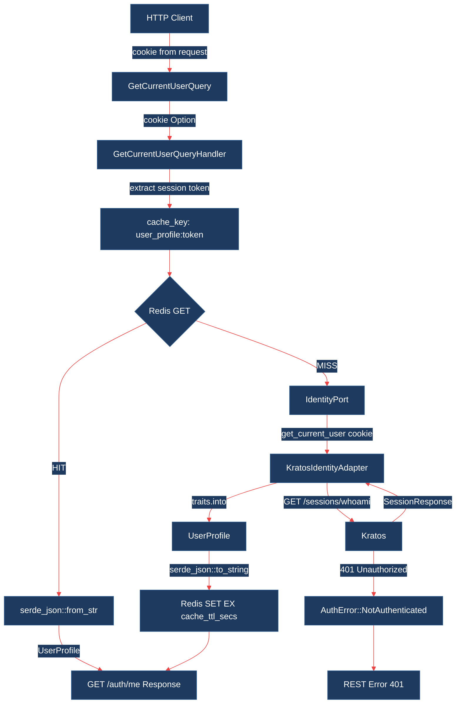
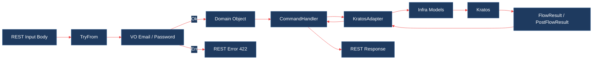

# Auth Service

<div align="left">

  <!-- CI/CD -->
  <a href="https://github.com/vwency/engineer-challenge/actions/workflows/backend-push.yaml"></a>
  <a href="https://github.com/vwency/engineer-challenge/actions/workflows/frontend-push.yaml"></a>

  <!-- Code quality -->
  <a href="https://sonarcloud.io/summary/new_code?id=vwency_engineer-challenge"></a>
  <a href="https://sonarcloud.io/summary/new_code?id=vwency_engineer-challenge"></a>
  <a href="https://sonarcloud.io/summary/new_code?id=vwency_engineer-challenge"></a>

  <!-- Meta -->
  <a href="https://github.com/vwency/engineer-challenge/blob/main/LICENSE"></a>
  

</div>

## Description
Проект реализует функции восстановление пароля, регистрация, авторизации, максимально приближенные к prod-ready решениям. С кэшированием в valkey(open source форк redis)  

---

<details>
<summary><strong>Architecture</strong></summary>  
<br>

| Паттерн | Что даёт |
|---|---|
| Hexagonal architecture | Отвязка реализации от транспорта через порты |
| DDD | Фокус на доменной логике, чёткое разделение бизнес-слоёв |
| DI | Слабая связанность, гибкость замены реализаций |
| CQRS | Разделение чтения/записи, оптимизация I/O, масштабируемость |

</details>

---  

<details>
<summary><strong>Tech stack</strong></summary>
<br>
    
| Технология | Причина выбора |
|---|---|
| REST | Поддержка `Set-Cookie` и HTTP статус-кодов в запросе |
| Yarn berry | Большое сообщество, гибкая кастомизация |
| NX | Ускорение сборки, сокращение времени CI |
| Rust | Строгая типизация, гарантия корректности, гибкость архитектуры |
| Valkey | Поддерживается AWS, Google, Oracle, Ericsson — в отличие от Redis OSS, где единственный вендор Redis Ltd. |

</details>

---

<details>
<summary><strong>Trade-offs</strong></summary>
<br>

| Решение | Причина | Когда пересмотреть |
|---|---|---|
| Дублирование стилей/tsx | Скорость прототипирования | Перед подготовкой к prod-ready |
| Redux | Скорость прототипирования + архитектура | Возможен пересмотр при разработке |
| Webpack (HMR, hot-reload) | HMR из коробки, turbopack его не поддерживает | При появлении HMR в turbopack |
| Нет подтверждения пароля по почте при регистрации | Время отладки | Рефакторинг во время разработки |
| Нет полноценного IaC | Время | При enterprise подготовке к prod |
| Cookie-based сессии вместо JWT | Один сервис, нет экосистемы | При масштабировании или добавлении новых сервисов |
| Auth-сервис как единый Bounded Context | Дробить BC — over-engineering | При выделении отдельных поддоменов |
| Ory экосистема | гибкость конфигурации и интеграция с hydra для OpenID | При enterprise+ |

</details>

---  

<details>
<summary><strong>Roadmap</strong></summary>
<br>

1. GitOps — чтение новых helm релизов и их применение.
2. Coverage тесты в CI, codecov, SonarQube.  
3. Нагрузочные тесты на GetCurrentUserQuery, Commands

</details>

---

<details>
<summary><strong>Diagrams</strong></summary>
<br>
Схема command запроса:

```mermaid
%%{init: {'theme': 'base', 'themeVariables': {'primaryColor': '#1E3A5F', 'primaryTextColor': '#FFFFFF', 'primaryBorderColor': '#2D5A8E', 'lineColor': '#EF4444', 'secondaryColor': '#162D4A', 'tertiaryColor': '#0F1F35', 'clusterBkg': '#0F1F35', 'clusterBorder': '#2D5A8E', 'titleColor': '#FFFFFF', 'edgeLabelBackground': '#1E3A5F', 'nodeTextColor': '#FFFFFF'}}}%%
flowchart LR
    Client[HTTP Client]
    Client -->|Email + Password| TryFrom
    subgraph Validation
        TryFrom -->|Email + Password VO| LoginCommand
        TryFrom -->|Err| RestError[REST Error 422]
    end
    subgraph Application
        LoginCommand --> LoginCommandHandler
    end
    subgraph Initiate
        LoginCommandHandler -->|initiate_login cookie| AuthenticationPort
        AuthenticationPort --> KratosAuthenticationAdapter
        KratosAuthenticationAdapter -->|whoami| Kratos
        Kratos -->|SessionStatus| KratosAuthenticationAdapter
        KratosAuthenticationAdapter -->|fetch_flow| Kratos
        Kratos -->|flow_id + csrf_token| KratosAuthenticationAdapter
    end
    subgraph Complete
        LoginCommandHandler -->|complete_login credentials| AuthenticationPort2[AuthenticationPort]
        AuthenticationPort2 --> KratosAuthenticationAdapter2[KratosAuthenticationAdapter]
        KratosAuthenticationAdapter2 -->|build| LoginPayload[LoginPayload Infra Model]
        LoginPayload -->|POST flow| Kratos2[Kratos]
        Kratos2 -->|SessionCookie| KratosAuthenticationAdapter2
    end
    KratosAuthenticationAdapter -->|SessionCookie| LoginCommandHandler
    LoginCommandHandler -->|session_token| Client
    Client -->|Set-Cookie| RestResponse[POST /auth/login Response]
```



Реализация кэша redis для запрос Query, что бы не загружать postgres.


Валидация входных данных:

</details>

---  

<details>
<summary><strong>Запуск & тесты</strong></summary>
<br>
    
## Running  
```bash
make up
```

## Testing  

Для запуска тестов в kratos требуется поднятие инфры (kratos, postgres, mailhog, redis):
```bash
cd web/backend/rust_kratos && make infra-up && cargo test ; cd ../../../
```

На фронтенде:
```bash
cd web/frontend && yarn install && yarn test ; cd ../../
```
</details>
