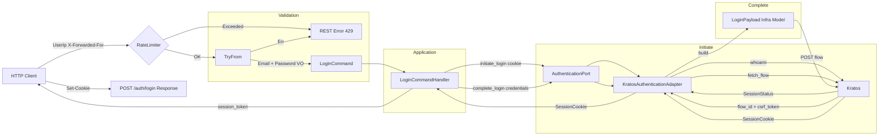
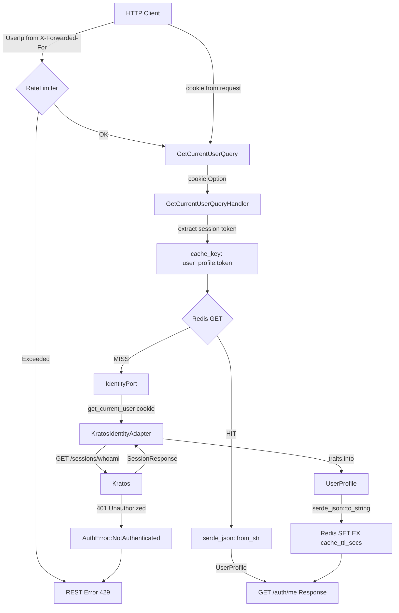
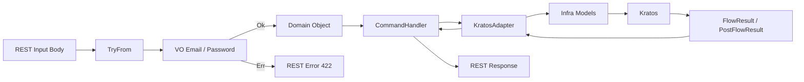

# Auth Service
<div align="left">
  <a href="https://sonarcloud.io/summary/new_code?id=vwency_engineer-challenge"></a>
  <a href="https://sonarcloud.io/summary/new_code?id=vwency_engineer-challenge"></a>
  <a href="https://sonarcloud.io/summary/new_code?id=vwency_engineer-challenge"></a>
  
  
  
  
  
  
  <a href="https://github.com/vwency/engineer-challenge/actions/workflows/backend-push.yaml"></a>
</div>

## Description 
Проект реализует функции восстановление пароля, регистрация, авторизации, максимально приближенные к prod-ready решениям. С кэшированием в valkey(open source форк redis)
 
## Architecture

**DDD**  
- Фокус на доменной логике  (entities, port/in ports/out)
- Улучшенная поддерживаемость  
- Чёткое разделение бизнес-слоёв

**DI**  
- Слабая связанность компонентов  
- Упрощённое тестирование  
- Гибкость замены реализаций

**CQRS**  
- Разделение операций чтения и записи  
- Оптимизация I/O  
- Улучшенная масштабируемость  

**ADR References:**  
- [Cookie-based Session Authentication](./docs/adr/0001-cookie-session.md)  
- [Valkey Cache for Session Profiles](./docs/adr/0003-valkey-cache.md)  

## Tech stack
1. **REST**, поскольку поддерживает в запросе `Set-Cookies`, статус коды http.
2. **Yarn berry** большое сообщество, кастомизация.  
3. **NX** время сборки, уменьшение времени на CI.  
4. **Rust** строгая типипизация, гарантия доставки, гибкость в архитектуре.
5. **Valkey**  Поддержка — Valkey поддерживается крупными компаниями: AWS, Google, Oracle, Ericsson. Redis Ltd. — единственный вендор Redis OSS.


## Trade-offs  
| Решение | Причина | Когда пересмотреть |
|---|---|---|
| Дублирование стилей/tsx | Скорость прототипирования | Перед подготовкой к prod-ready |
| Redux | Скорость прототипирования + архитектура | Возможен пересмотр при разработке |
| Webpack (HMR, hot-reload) | HMR из коробки, turbopack его не поддерживает | При появлении HMR в turbopack |
| Нет подтверждения пароля по почте при регистрации | Время отладки | Рефакторинг во время разработки |
| Нет полноценного IaC | Время | При enterprise подготовке к prod |
| Cookie-based сессии вместо JWT | Один сервис, нет экосистемы; сессия шарится cross-domain с `credentials: include` | При масштабировании или добавлении новых сервисов |
| Auth-сервис как единый Bounded Context | Дробить BC внутри одного сервиса — over-engineering без реальных причин | При выделении отдельных поддоменов в рамках роста системы |
| Ory экосистема | гибкость конфигурации и интеграция с hydra для OpenID | При enterprise+ |

### Continue
1. GitOps — чтение новых helm релизов и их применение.
2. Coverage тесты в CI, codecov, SonarQube.  
3. Нагрузочные тесты на GetCurrentUserQuery, Commands

Схема command запроса:
Схема command запроса:


Реализация кэша redis для запрос Query, что бы не загружать postgres.


Валидация входных данных:


## Running  
```bash
make up
```

## Testing  

Для запуска тестов в kratos требуется поднятие инфры (kratos, postgres, mailhog, redis):
```bash
cd web/backend/rust_kratos && make infra-up && cargo test ; cd ../../../
```

На фронтенде:
```bash
cd web/frontend && yarn install && yarn test ; cd ../../
```
